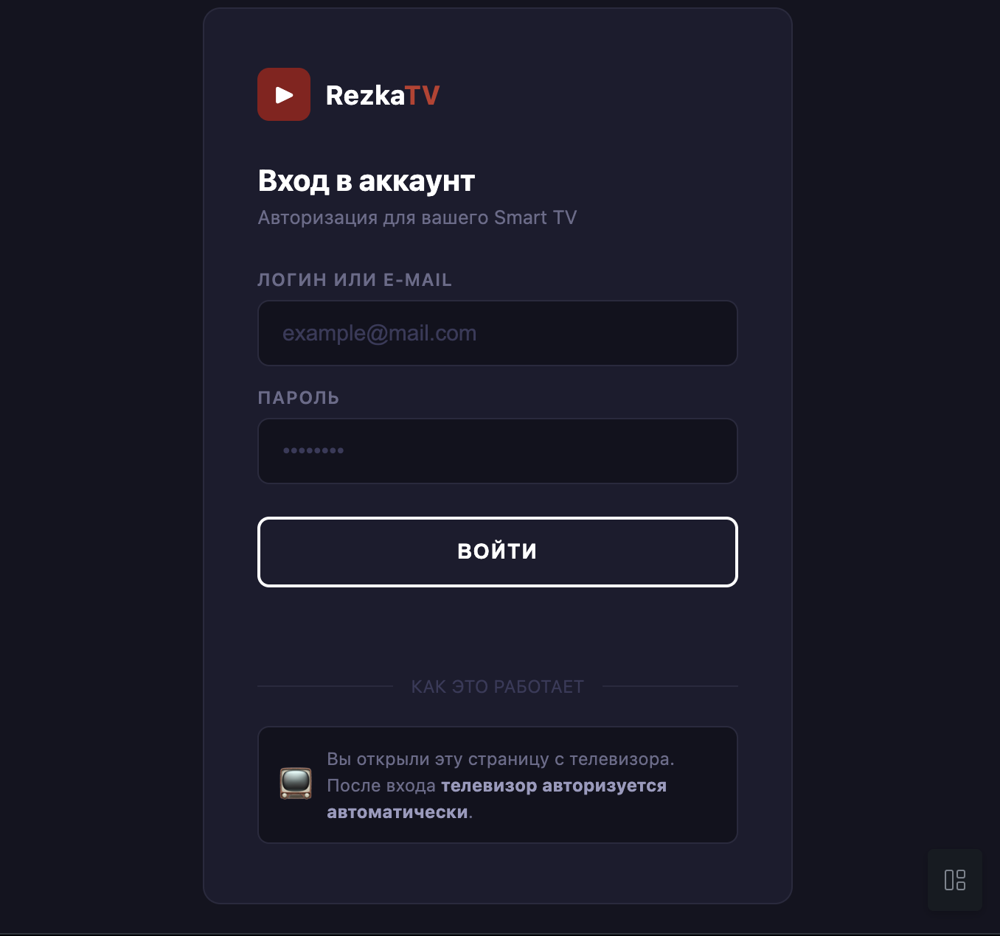

# RezkaTV QR Auth Server

A lightweight server for authenticating HDRezka accounts on Smart TV via QR code scanning.

## Preview



## How It Works

```
┌─────────────┐     1. Create session        ┌─────────────┐
│             │ ───────────────────────────► │             │
│   Smart TV  │   POST { host: "hdrezka.ag" }│   Server    │
│             │ ◄─────────────────────────── │             │
└─────────────┘     2. Return token          └─────────────┘
                                                        │
      ┌─────────────────────────────────────────────────┘
      │ 3. Display QR code with token
      ▼
┌─────────────┐     4. Open auth page       ┌─────────────┐
│             │ ─────────────────────────►  │             │
│  Smartphone │     5. Submit credentials   │   Server    │
│             │ ◄─────────────────────────  │             │
└─────────────┘     6. Login to HDRezka     └─────────────┘
                                                        │
      ┌─────────────────────────────────────────────────┘
      │ 7. Return cookies to TV
      ▼
┌─────────────┐
│   Smart TV  │ ◄── 8. Poll status & get cookies
└─────────────┘
```

## Features

- QR code authentication for HDRezka on Smart TV
- Dynamic host selection (supports different HDRezka mirrors)
- Session-based flow with 5-minute TTL
- Automatic cleanup of expired sessions
- Mobile-friendly auth page
- Docker support with Bun runtime
- Nginx reverse proxy with HTTPS (Let's Encrypt)

## Quick Start

### Using Bun (local development)

```bash
bun install
bun run start
```

### Using Node.js

```bash
npm install
npm start
```

### Using Docker (production)

```bash
# Create .env file from example
cp .env-example .env

# Edit .env with your domain and email
vim .env

# Start services
docker-compose up -d

# Obtain SSL certificate (first time only)
docker-compose run --rm certbot certonly \
  --webroot -w /var/www/certbot \
  -d $DOMAIN \
  --email $CERTBOT_EMAIL \
  --agree-tos --no-eff-email

# Restart nginx to apply SSL
docker-compose restart nginx
```

Server will be available at `https://your-domain.com`

## API Endpoints

| Method | Endpoint                   | Description                                  |
| ------ | -------------------------- | -------------------------------------------- |
| `POST` | `/session/create`          | Create new auth session, returns `{ token }` |
| `GET`  | `/session/check?t=<token>` | Check session status                         |
| `POST` | `/session/submit`          | Submit credentials from smartphone           |
| `GET`  | `/auth?t=<token>`          | Auth page for smartphone (QR target)         |

### POST /session/create

```json
// Request (optional body)
{ "host": "hdrezka.ag" }

// Response
{ "token": "a1b2c3d4e5f6..." }
```

### POST /session/submit

```json
// Request
{ "token": "a1b2c3d4...", "login": "user@example.com", "password": "secret" }

// Response
{ "success": true }
```

### Session Status Response

```json
{ "status": "pending" }
{ "status": "done", "cookies": "dle_user_id=...; dle_password=..." }
{ "status": "error", "error": "Invalid credentials" }
{ "status": "expired" }
```

## Environment Variables

| Variable       | Default      | Description                      |
| -------------- | ------------ | -------------------------------- |
| `PORT`         | `3000`       | Server port (internal)           |
| `HDREZKA_HOST` | `hdrezka.ag` | Default HDRezka host for login   |
| `DOMAIN`       | —            | Your domain for SSL certificate  |
| `CERTBOT_EMAIL`| —            | Email for Let's Encrypt notifications |

## Project Structure

```
rezkatv-qr/
├── index.js                 # Express server with session management
├── public/
│   ├── auth.html            # Mobile auth page
│   └── rezka-tv-qr.jpg      # QR code preview image
├── nginx/
│   └── default.conf.template# Nginx config template
├── Dockerfile               # Docker image with Bun
├── docker-compose.yml       # Docker Compose (app + nginx + certbot)
├── .env-example             # Environment variables template
├── package.json             # Project metadata
└── README.md                # This file
```

## Docker Services

| Service  | Description                              |
| -------- | ---------------------------------------- |
| `app`    | Bun server on port 3000 (internal)       |
| `nginx`  | Reverse proxy on ports 80, 443 with SSL  |
| `certbot`| SSL certificate renewal (Let's Encrypt)  |

## Integration with Smart TV App

### Step 1: Create Session

```javascript
const res = await fetch("https://your-domain.com/session/create", {
  method: "POST",
  headers: { "Content-Type": "application/json" },
  body: JSON.stringify({ host: "hdrezka.ag" }),
});
const { token } = await res.json();
```

### Step 2: Generate QR Code

```javascript
const authUrl = `https://your-domain.com/auth?t=${token}`;
// Display this URL as QR code on TV
```

### Step 3: Poll for Status

```javascript
const pollInterval = setInterval(async () => {
  const res = await fetch(`https://your-domain.com/session/check?t=${token}`);
  const data = await res.json();

  if (data.status === "done") {
    clearInterval(pollInterval);
    // Use data.cookies for HDRezka API calls
  } else if (data.status === "error" || data.status === "expired") {
    clearInterval(pollInterval);
    // Handle error or refresh QR
  }
}, 2000);
```

## Security Notes

- Sessions expire after 5 minutes (TTL: 300000ms)
- Tokens are single-use (deleted after successful auth)
- Automatic cleanup removes expired sessions every 60 seconds
- Credentials are transmitted over HTTPS to HDRezka
- Production setup uses HTTPS via Let's Encrypt

## License

MIT License - see [LICENSE](LICENSE) file.