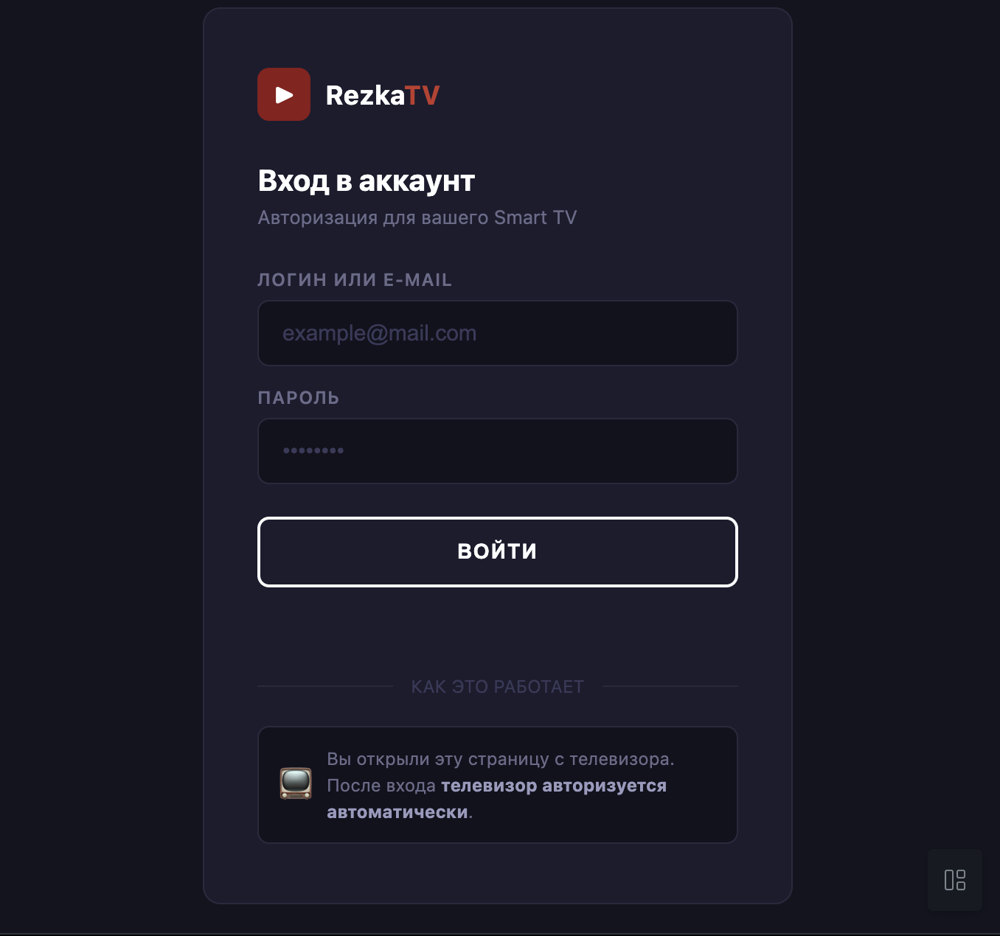

# RezkaTV QR Auth Server

> [!WARNING]
> This project is an **independent, non-commercial development** and is not affiliated with the "HDRezka" online cinema (hdrezka.ag), its administration, or its owners in any way. The application does not distribute any content; it merely provides a tool for authenticating on the site from Smart TVs.

> [!CAUTION]
> The use of this software is entirely **at your own risk**. The author of the project bears no legal, financial, or other responsibility for:
>
> - Potential damage to or loss of your data.
> - Blocking of your accounts or IP addresses, or restriction of access to services.
> - The functionality of the application in the event of changes to the site's API or structure.
> - Any other negative consequences that may arise from the use of this authorization server.
>
> By providing your credentials to the application, you agree that you are solely responsible for their security and the legitimacy of their use.

## Table of Contents

- [Preview](#preview)
- [How It Works](#how-it-works)
- [Features](#features)
- [Quick Start](#quick-start)
- [API Endpoints](#api-endpoints)
- [Environment Variables](#environment-variables)
- [Project Structure](#project-structure)
- [Docker Services](#docker-services)
- [Integration with Smart TV App](#integration-with-smart-tv-app)
- [Security Notes](#security-notes)
- [License](#license)

A lightweight server for authenticating HDRezka accounts on Smart TV via QR code scanning.

## Preview



## How It Works

```text
┌─────────────┐     1. Create session        ┌─────────────┐
│             │ ───────────────────────────► │             │
│   Smart TV  │   POST { host: "hdrezka.ag" }│   Server    │
│             │ ◄─────────────────────────── │             │
└─────────────┘     2. Return token          └─────────────┘
                                                        │
      ┌─────────────────────────────────────────────────┘
      │ 3. Display QR code with token
      ▼
┌─────────────┐     4. Open auth page       ┌─────────────┐
│             │ ─────────────────────────►  │             │
│  Smartphone │     5. Submit credentials   │   Server    │
│             │ ◄─────────────────────────  │             │
└─────────────┘     6. Login to HDRezka     └─────────────┘
                                                        │
      ┌─────────────────────────────────────────────────┘
      │ 7. Store cookies in session
      ▼
┌─────────────┐     8. Poll for status      ┌─────────────┐
│             │ ─────────────────────────►  │             │
│   Smart TV  │     9. Return cookies       │   Server    │
│             │ ◄─────────────────────────  │             │
└─────────────┘                             └─────────────┘
```

### Detailed Flow

1. **Create session**: The Smart TV app sends a POST request to `/session/create` with the preferred HDRezka host.
2. **Return token**: The server initializes a new session with a 5-minute TTL and returns a unique 16-byte hex token.
3. **Display QR code with token**: The Smart TV application generates and displays a QR Code containing the auth URL: `https://your-domain.com/auth?t={token}`.
4. **Open auth page**: The user scans the QR code with their smartphone, which opens the mobile-friendly web authentication page.
5. **Submit credentials**: The user fills in their HDRezka login and password and submits the form (POST to `/session/submit`).
6. **Login to HDRezka**: The server sends a background request to the specified HDRezka host, handling CSRF tokens and logging the user in.
7. **Store cookies in session**: Upon successful authentication, the server securely stores the returned HDRezka session cookies in its own temporary session storage.
8. **Poll for status**: Meanwhile, the Smart TV app continuously polls `/session/check?t={token}` every 2 seconds.
9. **Return cookies**: Once the server sees the auth was successful (`status: "done"`), it returns the saved cookies to the Smart TV, which then apply them to the TV player's internal web engine or API requests. The token is immediately deleted from the server.

## Features

- QR code authentication for HDRezka on Smart TV
- Dynamic host selection (supports different HDRezka mirrors)
- **Advanced Rate Limiting**: Multi-layered protection via Nginx (`limit_req`, `limit_conn`) and Express.js to prevent brute-force and DDoS attacks.
- **Bot Protection**: Nginx configuration blocks known malicious user-agents (e.g., sqlmap, nmap, masscan).
- Session-based flow with 5-minute TTL and automatic cleanup
- Automatic Nginx log rotation (7 days retention with compression)
- **Privacy First**: User logins and emails are masked in application logs.
- Modern, responsive UI for auth and custom error pages
- Docker support with Bun runtime
- Protected Nginx reverse proxy (configured for CloudFlare Full/Strict SSL + SOPS encryption)
- **Hardened Security Headers**: Enforces HSTS, CSP, X-Frame-Options, and more.

## Quick Start

### Using Bun (local development)

```bash
bun install
bun run start
```

### Using Node.js

```bash
npm install
npm start
```

### Using Docker (production)

#### Step 0: Install dependencies & configure firewall

On a fresh server, you need to install essential packages (including `make` and `docker`) and configure the UFW firewall and fail2ban.

```bash
# 1. Install dependencies
bash scripts/setup-deps.sh

# 2. Configure UFW firewall (Run as root or with sudo)
make setup-ufw

# 3. Configure fail2ban (Run as root or with sudo)
make setup-fail2ban

# 4. Configure logrotate for Nginx (Run as root or with sudo)
make setup-logrotate
```

#### Step 1: Initialize SOPS and generate Age key

```bash
make sops-init
# Update .sops.yaml with the generated public key
```

#### Step 2: Add and encrypt your domain certificates

Obtain your origin certificates from Cloudflare (Origin CA).
Save them as:

- `certs/crt.pem`
- `certs/crt.key`

Encrypt them to safely commit into the repository:

```bash
make sops-enc
```

#### Step 3: Create .env file

```bash
cp .env-example .env
vim .env  # Set DOMAIN
```

#### Step 4: Start services

```bash
make deploy
```

Server will be available at `http://your-domain.com` (or `https://` if proxied via CloudFlare).

#### Available Make Commands

| Command                | Description                                     |
| ---------------------- | ----------------------------------------------- |
| `make help`            | Show all available commands                     |
| `make up`              | Start all services                              |
| `make down`            | Stop all services                               |
| `make restart`         | Restart nginx                                   |
| `make restart-app`     | Rebuild and restart the Node.js API             |
| `make logs`            | Show nginx logs                                 |
| `make sops-init`       | Generate new age key for SOPS                   |
| `make sops-enc`        | Encrypt origin certificates                     |
| `make sops-dec`        | Decrypt certificates for Nginx                  |
| `make setup-ufw`       | Auto-configure UFW firewall                     |
| `make setup-fail2ban`  | Auto-configure fail2ban rules                   |
| `make setup-logrotate` | Install nginx logrotate configuration           |
| `make logrotate-check` | Dry-run logrotate (no changes, just validation) |
| `make logrotate-run`   | Force logrotate right now (for testing)         |
| `make deploy`          | Full deploy: decrypt certs & start services     |

## API Endpoints

| Method | Endpoint                   | Description                                  |
| ------ | -------------------------- | -------------------------------------------- |
| `POST` | `/session/create`          | Create new auth session, returns `{ token }` |
| `GET`  | `/session/check?t=<token>` | Check session status                         |
| `POST` | `/session/submit`          | Submit credentials from smartphone           |
| `GET`  | `/auth?t=<token>`          | Auth page for smartphone (QR target)         |

### POST /session/create

```json
// Request (optional body)
{ "host": "hdrezka.ag" }

// Response
{ "token": "a1b2c3d4e5f6..." }
```

### POST /session/submit

```json
// Request
{ "token": "a1b2c3d4...", "login": "user@example.com", "password": "secret" }

// Response
{ "success": true }
```

### Session Status Response

```json
{ "status": "pending" }
{ "status": "done", "cookies": "dle_user_id=...; dle_password=..." }
{ "status": "error", "error": "Invalid credentials" }
{ "status": "expired" }
```

## Environment Variables

| Variable       | Default      | Description                    |
| -------------- | ------------ | ------------------------------ |
| `PORT`         | `3000`       | Server port (internal)         |
| `HDREZKA_HOST` | `hdrezka.ag` | Default HDRezka host for login |
| `DOMAIN`       | —            | Your domain for nginx routing  |

## Project Structure

```text
rezkatv-qr/
├── certs/                   # Directory for SSL certificates
│   ├── enc.crt.key          # SOPS-encrypted private key
│   └── enc.crt.pem          # SOPS-encrypted public cert
├── nginx/
│   ├── default.conf.template # Nginx reverse proxy configuration
│   └── logrotate.conf       # Log rotation configuration
├── public/
│   ├── auth.html            # Mobile auth page
│   ├── error.html           # Custom error pages template
│   ├── icon.png             # Web app icon
│   └── rezka-tv-qr.jpg      # Preview image (plus others)
├── scripts/                 # Server setup and deployment scripts
│   ├── setup-deps.sh
│   ├── setup-fail2ban.sh
│   └── setup-ufw.sh
├── .env-example             # Environment variables template
├── .gitignore               # Git ignored files
├── .sops.yaml               # SOPS age configuration
├── docker-compose.yml       # Docker Compose (app + nginx)
├── Dockerfile               # Docker image with Bun
├── index.js                 # Express server with session management
├── LICENSE                  # MIT License
├── Makefile                 # Deploy automation commands
├── package.json             # Project metadata
└── README.md                # This file
```

## Docker Services

| Service | Description                             |
| ------- | --------------------------------------- |
| `app`   | Bun server on port 3000 (internal)      |
| `nginx` | Reverse proxy on ports 80, 443 with SSL |

## Integration with Smart TV App

### Step 1: Create Session

```javascript
const res = await fetch("https://your-domain.com/session/create", {
  method: "POST",
  headers: { "Content-Type": "application/json" },
  body: JSON.stringify({ host: "hdrezka.ag" }),
});
const { token } = await res.json();
```

### Step 2: Generate QR Code

```javascript
const authUrl = `https://your-domain.com/auth?t=${token}`;
// Display this URL as QR code on TV
```

### Step 3: Poll for Status

```javascript
const pollInterval = setInterval(async () => {
  const res = await fetch(`https://your-domain.com/session/check?t=${token}`);
  const data = await res.json();

  if (data.status === "done") {
    clearInterval(pollInterval);
    // Use data.cookies for HDRezka API calls
  } else if (data.status === "error" || data.status === "expired") {
    clearInterval(pollInterval);
    // Handle error or refresh QR
  }
}, 2000);
```

## Security Notes

- Sessions expire after 5 minutes (TTL: 300000ms)
- Tokens are single-use (deleted after successful auth)
- Automatic cleanup removes expired sessions every 60 seconds
- **Rate-Limiting**: The application limits session creation (5/min per IP) and authentication attempts (10/min per IP) to prevent abuse. Nginx adds an additional layer of request and connection limiting.
- **Bot Blocking**: Nginx actively denies access to known malicious user agents.
- **Data Privacy**: Sensetive information like user logins/emails are masked in the server logs (e.g., `us***@e***.com`).
- Nginx logs are rotated daily, compressed, and retained for 7 days
- Credentials are transmitted over HTTPS to HDRezka
- Production setup uses Cloudflare's Strict/Full SSL with encrypted origin certificates via SOPS
- **Strict Host Routing**: Nginx automatically redirects unknown hosts or direct IP accesses to the official HTTPS `DOMAIN`, protecting against IP scanning.
- **Security Headers**: Nginx is configured with strict security headers, including HSTS, X-Frame-Options, X-Content-Type-Options, Referrer-Policy, and Content-Security-Policy (CSP).

## License

MIT License - see [LICENSE](LICENSE) file.
