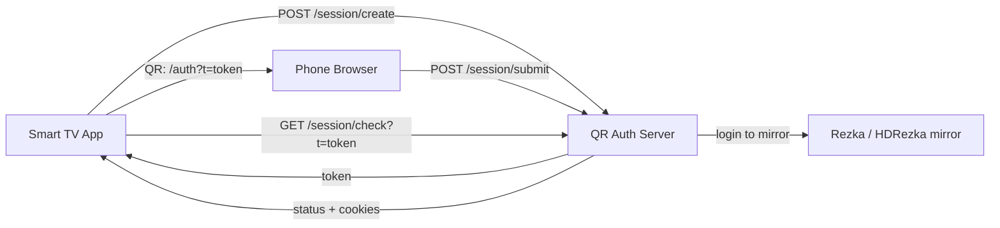

# RezkaTV QR Auth Server

[](https://ko-fi.com/I2I81X6E3R)

> [!WARNING]
> This is an independent, non-commercial project and is not affiliated with HDRezka or its owners.

> [!CAUTION]
> Use at your own risk. You are fully responsible for account safety, legal compliance, and deployment security.

QR-based authentication bridge for Smart TV apps: user logs in on phone, TV receives authenticated cookies.

## Table of Contents

- [Overview](#overview)
- [How It Works](#how-it-works)
- [Features](#features)
- [Quick Start](#quick-start)
- [API](#api)
- [Environment Variables](#environment-variables)
- [Security](#security)
- [Observability](#observability)
- [Smoke Test](#smoke-test)
- [Project Structure](#project-structure)
- [License](#license)

## Overview

- Server: Express (`index.js`)
- Reverse proxy: Nginx (`nginx/default.conf.template`)
- Runtime in Docker image: Bun (`Dockerfile`)
- Session storage: in-memory (token TTL = 5 minutes)

## How It Works


```mermaid
flowchart LR
    TV["Smart TV App"] -->|"POST /session/create"| API["QR Auth Server"]
    API -->|"token"| TV
    TV -->|"QR: /auth?t=token"| PHONE["Phone Browser"]
    PHONE -->|"POST /session/submit"| API
    API -->|"login to mirror"| MIRROR["Rezka / HDRezka mirror"]
    TV -->|"GET /session/check?t=token"| API
    API -->|"status + cookies"| TV
```

## Features

- QR login flow for Smart TV.
- Mirror-aware auth with fallback (`MIRROR_FALLBACKS`).
- Host policy validation (public FQDN + keyword/regex policy).
- CSRF extraction fallback from hidden input and JS var.
- Success detection for JSON success and redirect/non-JSON + auth-cookie.
- Mandatory post-login session verification (`GET /` + user marker checks).
- Rich error contract: `error`, `error_code`, `message`, `host`, `phase`.
- Security hardening: `helmet`, strict JSON parsing with size limit, anti-bruteforce (`ip+login` window), per-token limits and in-flight lock, `no-store` cache headers for sensitive routes.
- Structured JSON logs + request correlation (`X-Request-ID`).
- Health endpoints and Prometheus metrics.

## Quick Start

### Local (Node.js)

```bash
npm install
npm start
```

### Local (Bun)

```bash
bun install
bun run start
```

### Docker

```bash
docker compose up -d --build
```

### Useful Make Commands

```bash
make help
```

Common targets:

- `make up`
- `make down`
- `make restart`
- `make restart-app`
- `make logs`
- `make deploy`

## API

### Endpoints

| Method | Endpoint | Description |
| --- | --- | --- |
| `POST` | `/session/create` | Create session, returns token |
| `POST` | `/session/submit` | Submit credentials from phone |
| `GET` | `/session/check?t=<token>` | Poll session status |
| `GET` | `/auth?t=<token>` | Mobile auth page |
| `GET` | `/health/live` | Liveness probe |
| `GET` | `/health/ready` | Readiness probe (mirror egress) |
| `GET` | `/metrics` | Prometheus metrics |

### `POST /session/create`

Request:

```json
{ "host": "hdrezka.sb" }
```

Success response:

```json
{ "token": "a1b2c3d4e5f6..." }
```

### `POST /session/submit`

Request:

```json
{ "token": "a1b2c3...", "login": "user@example.com", "password": "secret" }
```

Success response:

```json
{ "success": true, "host": "hdrezka.sb", "phase": "done" }
```

Error response:

```json
{
  "success": false,
  "error": "login_failed",
  "error_code": "login_failed",
  "message": "Неверный логин или пароль",
  "host": "hdrezka.sb",
  "phase": "login_post_credentials"
}
```

### `GET /session/check`

Possible responses:

```json
{ "status": "pending", "host": "hdrezka.sb", "phase": "login_get_page" }
```

```json
{
  "status": "error",
  "error": "timeout",
  "error_code": "timeout",
  "message": "Время ожидания истекло",
  "host": "hdrezka.sb",
  "phase": "login_get_page"
}
```

```json
{ "status": "done", "cookies": "dle_user_id=...; dle_password=...", "host": "hdrezka.sb", "phase": "done" }
```

```json
{ "status": "expired" }
```

### Error Codes

| Code | Meaning |
| --- | --- |
| `csrf_missing` | Mirror expects CSRF token but it was not extracted |
| `login_failed` | Invalid credentials or auth verification failed |
| `mirror_unreachable` | Mirror unavailable / network resolution failure |
| `timeout` | Upstream mirror request timed out |
| `invalid_host` | Host rejected by host security policy |
| `rate_limited` | Request throttled by app/nginx limits |

## Environment Variables

### App

| Variable | Default | Description |
| --- | --- | --- |
| `PORT` | `3000` | App port |
| `HDREZKA_HOST` | `hdrezka.ag` | Default preferred mirror |
| `AUTH_TIMEOUT_MS` | `10000` | Per upstream request timeout (ms) |
| `MAX_SUBMIT_FLOW_TIMEOUT_MS` | `20000` | Max total submit flow time (ms) |
| `JSON_BODY_LIMIT` | `8kb` | Max JSON body size |
| `MAX_SUBMIT_ATTEMPTS_PER_TOKEN` | `5` | Max submit attempts per token |
| `MAX_LOGIN_ATTEMPTS_PER_IP_LOGIN` | `10` | Max failed attempts per `ip+login` window |
| `LOGIN_ATTEMPT_WINDOW_MS` | `600000` | Bruteforce window in ms |
| `MIRROR_FALLBACKS` | `` | Comma-separated fallback hosts |
| `ALLOWED_HOST_KEYWORDS` | `rezka,hdrezka,rezk` | Host allow policy by keyword |
| `ALLOWED_HOST_REGEX` | `` | Optional allow policy regex |
| `HEALTHCHECK_HOST` | `HDREZKA_HOST` or `hdrezka.sb` | Host for readiness probe |
| `LOG_PENDING_CHECKS` | `0` | `1` enables verbose pending polling logs |

### Nginx / Compose

| Variable | Default | Description |
| --- | --- | --- |
| `DOMAIN` | — | Public domain used by nginx template |

## Security

- Strict host validation for `/session/create`: rejects IPs, localhost-like, malformed hostnames, and allows only hosts matching policy (`ALLOWED_HOST_KEYWORDS` / `ALLOWED_HOST_REGEX`).
- Token format validation (`32`-char hex).
- Single-use session semantics with in-flight lock.
- Session TTL: 5 minutes.
- Per-token and per `ip+login` throttling.
- `helmet` enabled at app layer.
- Strict JSON parser + graceful 400/413 error handling.
- Sensitive routes use `Cache-Control: no-store`.
- Login/email masked in logs.

## Observability

- App logs are JSON and include `request_id`, `event`, `host`, `phase`, `error_code`.
- Nginx access logs are JSON and include `$request_id`.
- `X-Request-ID` is propagated: nginx -> app -> client.
- `/metrics` exports uptime gauge, submit counter, auth result counters by `host/result`, and auth phase duration sum/count.

<details>
<summary>Example log event</summary>

```json
{
  "ts": "2026-04-03T13:52:33.900Z",
  "level": "info",
  "event": "auth.success",
  "request_id": "10193992-c797-4ba7-88f8-7ed96f71ae60",
  "token": "7553c71f...",
  "host": "hdrezka.sb",
  "login": "jo*****@m***.ru"
}
```

</details>

## Smoke Test

Run local smoke checks:

```bash
./scripts/smoke.sh
```

If `REZKATV_USERNAME` and `REZKATV_PASSWORD` are set, the script also validates successful auth.

## Project Structure

```text
rezkatv-qr/
├── certs/
│   ├── enc.crt.key
│   └── enc.crt.pem
├── nginx/
│   ├── default.conf.template
│   └── logrotate.conf
├── public/
│   ├── auth.html
│   ├── error.html
│   ├── icon.png
│   ├── rezka-tv-main-error.jpg
│   ├── rezka-tv-qr-error.jpg
│   └── rezka-tv-qr.jpg
├── scripts/
│   ├── smoke.sh
│   ├── setup-deps.sh
│   ├── setup-fail2ban.sh
│   └── setup-ufw.sh
├── bun.lock
├── docker-compose.yml
├── Dockerfile
├── index.js
├── LICENSE
├── Makefile
├── package-lock.json
├── package.json
└── README.md
```

## License

MIT — see [LICENSE](LICENSE).
